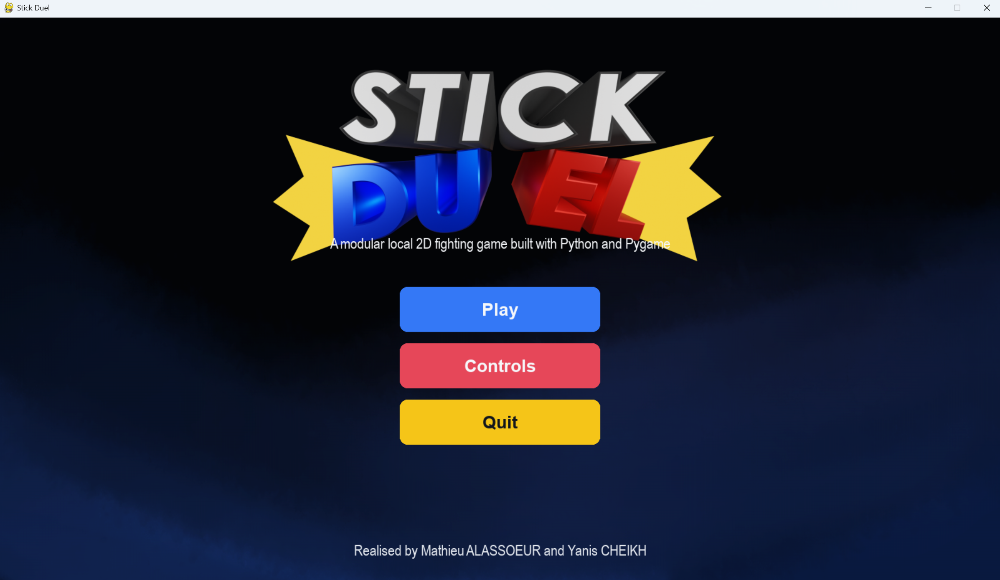
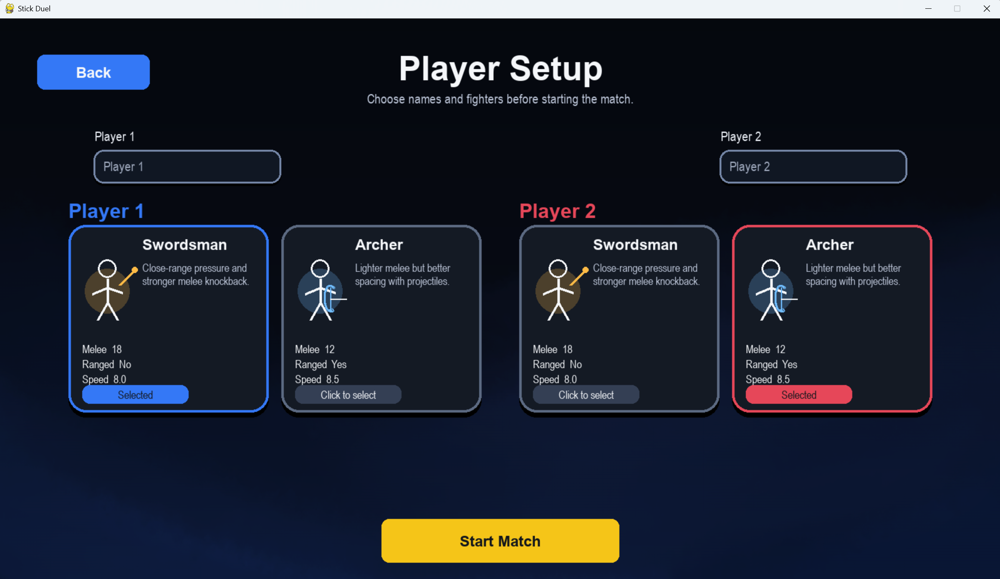
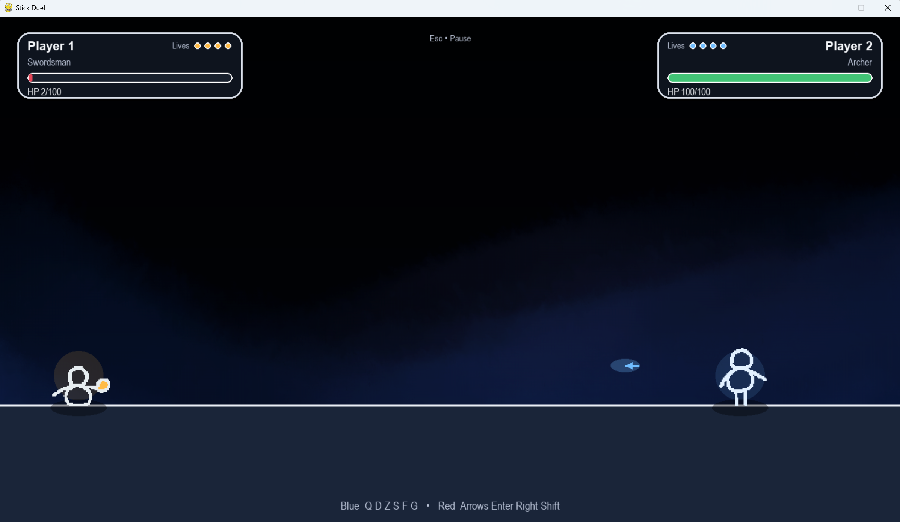

# Stick Duel

[](#installation)
[](#installation)
[](#features)
[](#license)

A local 1v1 fighting game built with **Python** and **Pygame**, designed with a strong focus on **clean architecture**, **finite state machines**, and **game feel**.

> Stick Duel is not just a playable game prototype. It is also an engineering project built to demonstrate modular design, extensibility, and maintainability in a real-time gameplay system.

---

## Table of Contents

- [Overview](#overview)
- [Why this project matters](#why-this-project-matters)
- [Features](#features)
- [Gameplay Overview](#gameplay-overview)
- [Controls](#controls)
- [Characters](#characters)
- [Screenshots and Demo](#screenshots-and-demo)
- [Technical Highlights](#technical-highlights)
- [Architecture](#architecture)
- [Project Structure](#project-structure)
- [Installation](#installation)
- [Run the Game](#run-the-game)
- [Run the Tests](#run-the-tests)
- [Release Notes](#release-notes)
- [Roadmap](#roadmap)
- [Known Limitations](#known-limitations)
- [Repository Metadata](#repository-metadata)
- [License](#license)

---

## Overview

Stick Duel is a two-player local fighting game featuring melee and ranged combat, hit reactions, knockback, screen feedback, and a scene-driven game loop.

The project is structured as a **modular game codebase**, with dedicated layers for:

- scene management
- combat logic
- fighter entities
- state machines
- effects and feedback
- UI components

This makes the project suitable both as a playable game and as a portfolio-grade example of Python software engineering applied to game development.

---

## Why this project matters

Many small Pygame projects work as demos but remain difficult to scale, test, or extend. Stick Duel is intentionally structured to avoid that trap.

This repository aims to demonstrate:

- a **src-layout Python package**
- clear separation between **runtime orchestration** and **gameplay logic**
- explicit **scene transitions**
- **FSM-based** fighter behavior
- isolated, testable combat mechanics
- a foundation that can evolve toward AI opponents, richer combat systems, and improved production quality

---

## Features

### Gameplay

- Local 1v1 combat
- Melee attacks with startup, active, and recovery phases
- Ranged attacks for projectile-capable fighters
- Knockback and hit detection
- Stock-based win condition
- Pause support during matches

### Game Feel

- Hit freeze
- Screen shake
- Impact particles
- Visual hit feedback
- Fighter flash / respawn feedback

### Engineering

- Finite State Machine based fighter logic
- Modular scene system
- Dedicated combat and entity modules
- Testable core behavior
- Package-based installation

---

## Gameplay Overview

A typical match flow is:

1. Open the menu
2. Go to the player setup screen
3. Select fighters and player names
4. Start the match
5. Fight until one player runs out of stocks
6. Transition to the victory scene

This explicit scene-driven flow is one of the strong architectural points of the project.

---

## Controls

### Player 1 (AZERTY)

- `Q` / `D` → Move
- `Z` → Jump
- `S` → Fast fall
- `F` → Melee
- `G` → Ranged

### Player 2

- `←` / `→` → Move
- `↑` → Jump
- `↓` → Fast fall
- `Enter` → Melee
- `Right Shift` → Ranged

### In Match

- `Esc` → Pause / resume

---

## Characters

### Swordsman

- Strong melee profile
- Higher close-range pressure
- No ranged attack

### Archer

- Lower direct melee pressure
- Projectile-based spacing
- Better ranged control

---

## Screenshots and Demo





---

## Technical Highlights

- **SceneManager** drives navigation between `menu`, `controls`, `setup`, `game`, and `victory`
- **SceneResult** gives a clean contract for transitions and quitting
- **FSM-based fighters** manage attack states, hitstun, respawn, and recovery
- **Combat phases** are explicit instead of hidden in monolithic update code
- **Projectile spawning** is isolated from input queuing
- **Respawn logic** resets fighters while preserving stock-based match flow
- **Effects modules** improve game feel without polluting core combat logic

---

## Architecture

### High-level flow

```text
Input
  -> Scene / Fighter input handling
  -> State machine transitions
  -> Combat resolution
  -> Effects triggering
  -> Rendering
```

### Main architectural components

#### `core/`
Shared scene abstractions and orchestration primitives.

#### `scenes/`
Top-level flow of the game:
- menu
- controls
- setup
- game
- victory

#### `entities/`
Domain objects such as fighters and gameplay-relevant runtime state.

#### `fighter_states/`
FSM states governing behavior transitions such as idle, run, attack, hitstun, dead, and respawn.

#### `combat/`
Collision, damage, and attack-specific mechanics.

#### `effects/`
Hit freeze, screen shake, impact particles, and related feedback systems.

#### `ui/`
Buttons, input widgets, HUD, and scene presentation helpers.

---

## Project Structure

```text
stick-duel/
├── assets/
├── src/
│   └── stick_duel/
│       ├── combat/
│       ├── core/
│       ├── effects/
│       ├── entities/
│       ├── fighter_states/
│       ├── scenes/
│       ├── ui/
│       ├── main.py
│       └── game.py
├── tests/
├── pyproject.toml
├── run_game.py
└── README.md
```

---

## Installation

### Requirements

- Python 3.11 or newer

### Recommended installation

Install the project as a package from the repository root:

```bash
pip install -e .
```

This is the correct workflow for the current `src/` layout and is preferable to manually modifying `sys.path`.

---

## Run the Game

After installation:

```bash
python run_game.py
```

Alternative package-based launch:

```bash
python -m stick_duel.main
```

---

## Run the Tests

```bash
pytest
```

If you want a more explicit command with coverage:

```bash
pytest --cov=stick_duel --cov-report=term-missing
```

---

## Release Notes

### v1.0.0 — Initial stable release

This release includes:

- playable local 1v1 combat
- scene-based game loop
- FSM-driven fighters
- melee and ranged combat
- hit detection and knockback
- particle and screen feedback systems
- initial automated tests
- package-based installation workflow

---

## Roadmap

### Short term

- strengthen automated tests
- remove remaining debug traces from runtime code
- add a complete release workflow
- improve README visuals with real screenshots and a gameplay GIF

### Mid term

- richer combat depth
- better animation polish
- sound design integration
- refined HUD and match feedback

### Long term

- AI opponent
- multiple arenas
- combat balancing
- deeper move sets
- optional online or remote-play friendly architecture

---

## Known Limitations

- Local multiplayer only
- No AI opponent yet
- Limited content compared with a full game release
- Repository still benefits from stronger CI and richer integration tests

---

## License

MIT License.
